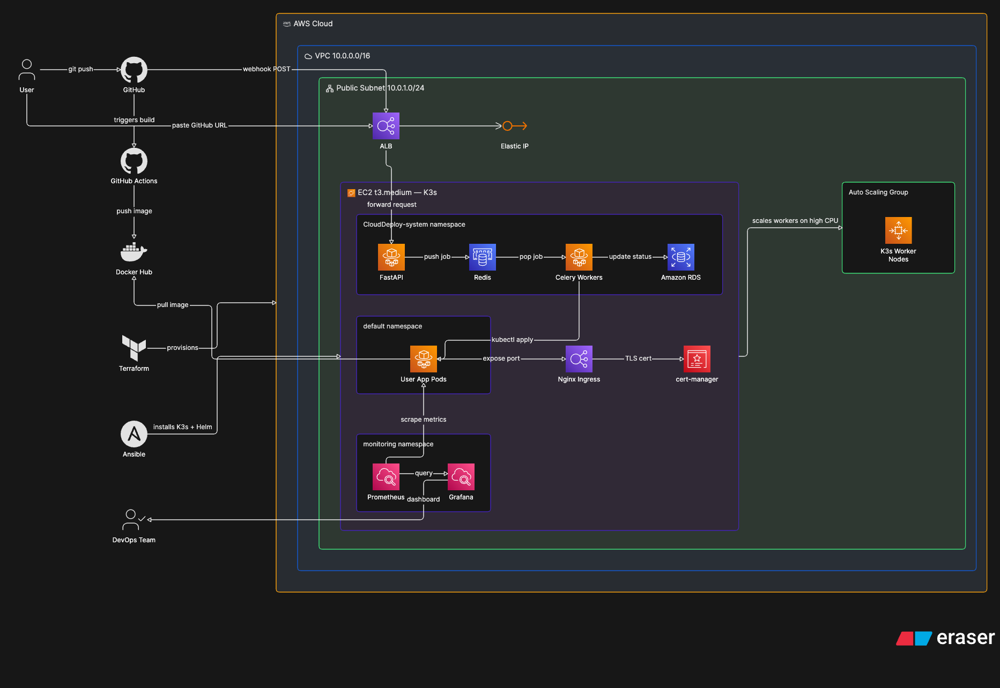

# CloudDeploy Architecture

CloudDeploy is a Platform as a Service (PaaS) that automatically deploys 
user applications from GitHub repositories — similar to Render or Railway. 
Users paste a GitHub URL, and CloudShip handles everything from building 
the Docker image to serving the app over HTTPS with a live URL.

---

## Architecture Diagram



---

## How it works

### First deployment
A user pastes their GitHub repository URL into the CloudDeploy interface. 
FastAPI receives the request and generates a unique deployment ID. 
An AI model scans the repository, detects the language and framework, 
and automatically generates an appropriate Dockerfile — no Docker knowledge 
required from the user. GitHub Actions then builds the Docker image and 
pushes it to Docker Hub. Celery picks up the deployment job from the Redis 
queue and applies Kubernetes manifests to the K3s cluster. The app runs as 
a Pod, Nginx Ingress routes a subdomain to it, and cert-manager 
automatically issues a Let's Encrypt TLS certificate. The user receives 
a live HTTPS URL within minutes.

### Auto redeployment
Once deployed, every subsequent `git push` to the user's repository 
triggers an automatic redeployment via GitHub webhook. The entire pipeline 
runs again — new image built, new Pod deployed, zero downtime rolling 
update — without any manual intervention from the user or the CloudShip team.

---

## Infrastructure

The infrastructure is fully automated using Infrastructure as Code. 
A single `terraform apply` provisions all AWS resources and triggers 
Ansible to configure the server — no manual steps required.

### AWS Resources
- **VPC** — isolated private network (10.0.0.0/16)
- **Public Subnet** — where all compute resources live (10.0.1.0/24)
- **Elastic IP** — fixed public IP that never changes across deploys
- **ALB** — Application Load Balancer, entry point for all traffic
- **EC2 t3.medium** — server running the K3s cluster
- **Auto Scaling Group** — manages K3s worker nodes, scales 1-3 based on CPU

### K3s Cluster (runs on EC2)
The EC2 instance runs a K3s Kubernetes cluster with three namespaces:

**clouddeploy-system** — CloudDeploy's own backend services
- FastAPI — receives deployment requests and manages the pipeline
- Redis — job queue for async deployment tasks
- Celery Workers — processes deployment jobs asynchronously
- Amazon RDS — stores deployment records and status

**default** — user application Pods, one per deployed app

**monitoring** — observability stack
- Prometheus — scrapes cluster metrics every 15 seconds
- Grafana — dashboards and alerts for the DevOps engineer

### Kubernetes components
- **Nginx Ingress Controller** — routes each app's subdomain to the 
  correct Pod automatically
- **cert-manager** — automatically issues and renews Let's Encrypt TLS 
  certificates for every deployed app

---

## Tech Stack

| Tool | Purpose |
|---|---|
| Terraform | Provisions all AWS infrastructure |
| Ansible | Configures EC2 and installs K3s via Helm |
| K3s | Lightweight Kubernetes for container orchestration |
| Helm | Package manager for Kubernetes — installs Nginx, cert-manager, Prometheus |
| Nginx Ingress | Routes subdomains to correct user app Pods |
| cert-manager | Automatic TLS certificate management via Let's Encrypt |
| Prometheus | Metrics collection from the K3s cluster |
| Grafana | Monitoring dashboards and alerting |
| Redis | Async job queue for deployment tasks |
| Celery | Background worker for running deployment jobs |
| FastAPI | Control plane API for CloudShip |
| GitHub Actions | CI pipeline — builds and pushes Docker images |
| Docker Hub | Container image registry |
| Amazon RDS | Deployment records and status tracking |

---

## Automation

The entire infrastructure lifecycle is automated:

```bash
# Bring everything up from scratch
terraform apply

# This automatically:
# 1. Provisions VPC, EC2, EIP, ASG, Security Groups
# 2. Runs Ansible via local-exec
# 3. Installs K3s on EC2
# 4. Installs Helm charts (Nginx, cert-manager, Prometheus, Grafana)
# 5. Configures Let's Encrypt ClusterIssuer
# 6. Creates Docker Hub imagePullSecret
# 7. Writes kubeconfig to local machine
# 8. Updates userdata.sh with K3s token for worker auto-join
```

Every new ASG worker node automatically joins the K3s cluster on startup 
via a bootstrap script — no manual configuration needed.

---

## Auto Scaling

Worker nodes scale automatically based on CPU utilization:
- CPU above 70% for 4 minutes → ASG adds a worker (max 3)
- CPU below 30% for 4 minutes → ASG removes a worker (min 1)
- New workers join the K3s cluster automatically via userdata.sh
- Kubernetes redistributes Pods across available nodes

---

## Security

- All internal cluster traffic restricted to VPC CIDR (10.0.0.0/16)
- Public ports limited to 80, 443, 22, 6443
- TLS enforced on every user app via cert-manager
- Docker Hub credentials stored as Kubernetes imagePullSecret
- Elastic IP ensures stable access without exposing dynamic IPs

---

## Team

| Member | Role | Responsibility |
|---|---|---|
| Arni | Infrastructure Engineer | Terraform, Ansible, K3s, Helm, TLS, Monitoring |
| Arman | Control Platform Engineer | FastAPI, Redis, Celery, webhooks, status tracking |
| Dikshita | Build System Engineer | GitHub Actions, AI Dockerfile generation, Docker Hub |
| Abhi | Deployment Engineer | Kubernetes manifests, rolling updates, live URLs |